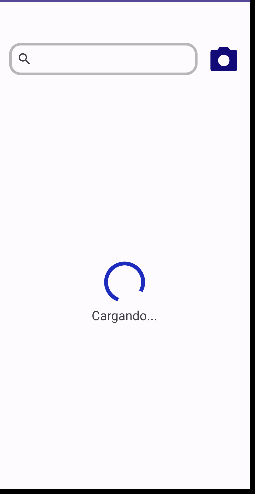

# Search

Aplicación para Android en lenguaje Kotlin

## Arquitectura utilizada

**MVVM**

Arquitectura reactiva donde se introdujo el concepto de ViewModel. Este componente tiene un ciclo de vida ligado al ciclo de vida de la vista que lo consume.

### Branches

1. main: Contiene el proyecto usando una base de datos local
2. room: contiene una base de dato usando courrutines
3. Flow: contiene una base de datos de un servicio web

## Proyeto

1. Carga de datos de una base de datos, usando la siguiente estructura


2. Muestra un ProgressBar mientras se cargan los datos

Para esto se agregó un delay para simular el retraso en la carga de datos

3. Muestra un mensaje en caso de encontrar resultados en la búsqueda

4. Incluye una búsqueda pormedio de la cámara (no implementada, por default carga un texto)

## Objetivo

Realizar una búsqueda de una lista precargada de la base de datos, como se muestra en la siguiente imagen.


El usuario puede ingresar datos en la casilla de búsqueda y se filtrarán aquellos medicamentos por nombre en ingles, en español o marca que contengan el texto ingresado, como se muestra en el ejemplo.


## Objetivo general

### Dependencia del build.gradle (Module:App)

```
android {
    ...

    buildFeatures {
        viewBinding = true
    }
}
dependencies {
    ...

    // biblioteca para realizar la carga y la representación de la imagen
    implementation 'com.squareup.picasso:picasso:2.8'

    // https://github.com/bumptech/glide
    implementation 'com.github.bumptech.glide:glide:4.15.1'

    ...
}
```

### settings.gradle

```
    repositories{
        google()
        mavenCentral()
    }
```

### AndroidManifest.xml

```
    <uses-permission android:name="android.permission.INTERNET" />

    <application
    ...

```

### Código de Glide

Glide es una biblioteca cargar imágenes, ver [About Glide](https://bumptech.github.io/glide/), además ver [repositorio de GitHub](https://bumptech.github.io/glide/)

```
    Glide
        .with(this)
        .load(medModel.photoSmall)
        .centerCrop()
        .skipMemoryCache(true)
        .diskCacheStrategy(DiskCacheStrategy.NONE)
        .placeholder(R.drawable.ic_image)
        .into(image)
```


# Imagen y texto de no encontró resultado en la búsqueda

**XML**

```
        <ImageView
            android:id="@+id/iv_add_icon"
            android:layout_width="64dp"
            android:layout_height="64dp"
            android:contentDescription="@string/no_medicine"
            android:src="@drawable/ic_add_note"
            app:layout_constraintBottom_toBottomOf="parent"
            app:layout_constraintEnd_toEndOf="parent"
            app:layout_constraintStart_toStartOf="parent"
            app:layout_constraintTop_toBottomOf="@+id/search_view" />

        <TextView
            android:id="@+id/tv_add_note"
            android:layout_width="wrap_content"
            android:layout_height="wrap_content"
            android:text="@string/no_search_result"
            android:textSize="@dimen/no_find_medicament"
            app:layout_constraintEnd_toEndOf="@id/medicaments_list"
            app:layout_constraintStart_toStartOf="parent"
            app:layout_constraintTop_toBottomOf="@id/iv_add_icon" />

        <androidx.constraintlayout.widget.Group
            android:id="@+id/no_medicaments_group"
            android:layout_width="wrap_content"
            android:layout_height="wrap_content"
            app:constraint_referenced_ids="iv_add_icon,tv_add_note"
            tools:visibility="gone" />
```

**Strig**

```
    <string name="no_search_result">no search results</string>
    <string name="no_search_result">no search results</string>
```

**Fragmento.kt**

```
    private lateinit var noMedGroup: Group

    private fun initViews(view: View){
        with(view){
            noMedGroup = findViewById(R.id.no_medicaments_group)
            noMedGroup.visibility = View.GONE
        }
    }

    private fun setSearchMessage(list: List<MedModel>) {
        if (list.isEmpty()){
            noMedGroup.visibility = View.VISIBLE
            medsList.visibility = View.GONE
        } else {
            noMedGroup.visibility = View.GONE
            medsList.visibility = View.VISIBLE
        }
    }
```

# ProgressBar

**XML**

```
        <ProgressBar
            android:id="@+id/pbLarge"
            style="?android:attr/progressBarStyleLarge"
            android:layout_width="wrap_content"
            android:layout_height="wrap_content"
            app:layout_constraintBottom_toBottomOf="parent"
            app:layout_constraintEnd_toEndOf="parent"
            app:layout_constraintStart_toStartOf="parent"
            app:layout_constraintTop_toBottomOf="@+id/search_view"/>

        <TextView
            android:id="@+id/tv_message_progress"
            android:layout_width="wrap_content"
            android:layout_height="wrap_content"
            android:text="Cargando..."
            android:textSize="@dimen/no_find_medicament"
            app:layout_constraintEnd_toEndOf="@id/medicaments_list"
            app:layout_constraintStart_toStartOf="parent"
            app:layout_constraintTop_toBottomOf="@id/pbLarge" />

        <androidx.constraintlayout.widget.Group
            android:id="@+id/progress_bar_group"
            android:layout_width="wrap_content"
            android:layout_height="wrap_content"
            app:constraint_referenced_ids="pbLarge,tv_message_progress"
            tools:visibility="gone" />
```


**Fragmento.kt**

```
    private lateinit var pbLarge: ProgressBar
    
    private lateinit var progressBarGroup: Group

    private fun initViews(view: View){
        with(view){
            pbLarge = findViewById(R.id.pbLarge)
            initProgressBar()
        }
    }

    private fun setSearchMessage(list: List<MedModel>) {
        if (list.isEmpty()){
            noMedGroup.visibility = View.VISIBLE
            medsList.visibility = View.GONE
        } else {
            noMedGroup.visibility = View.GONE
            medsList.visibility = View.VISIBLE
        }
    }

    private fun initProgressBar(){
        pbLarge.indeterminateDrawable.setColorFilter(ContextCompat.getColor(requireContext(),
        R.color.blue), PorterDuff.Mode.SRC_IN)

    }

        private fun observe(){
        findMedicamentViewModel.medListLiveData.observe(viewLifecycleOwner) {
            list ->
            initialList.clear()
            setProgressBar(initialList)
            initialList.addAll(list)
            // muestra
            showProgressBarWithDelay(initialList)
            // continua
        }
    }

        private fun showProgressBarWithDelay(list: List<MedModel>) {
        CoroutineScope(Dispatchers.Main).launch {
            withContext(Dispatchers.Main) {
                delay(3000)
                findMedicamentListAdapter.setData(initialList)
                setProgressBar(initialList)
            }
        }
    }

        private fun setProgressBar(list: List<MedModel>) {
        if (list.isEmpty()){
            progressBarGroup.visibility = View.VISIBLE
            medsList.visibility = View.GONE
        } else {
            progressBarGroup.visibility = View.GONE
            medsList.visibility = View.VISIBLE
        }
    }

```

