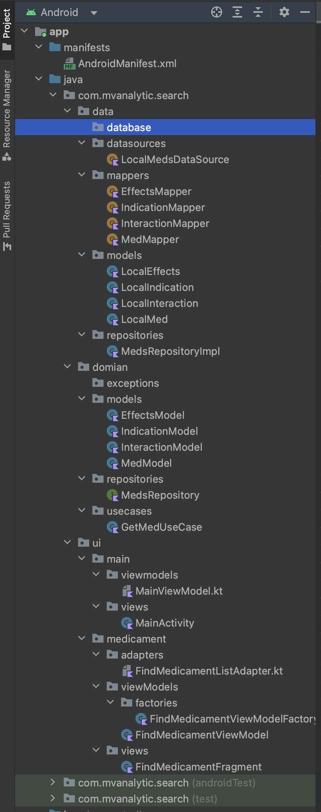
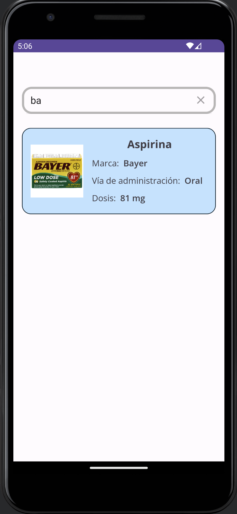

# Search

Aplicación para Android en lenguaje Kotlin

## Arquitectura utilizada

**MVVM**

Arquitectura reactiva donde se introdujo el concepto de ViewModel. Este componente tiene un ciclo de vida ligado al ciclo de vida de la vista que lo consume.

### Branches

1. main: Contiene el proyecto usando una base de datos local
2. room: contiene una base de dato usando courrutines
3. Flow: contiene una base de datos de un servicio web

## Proyeto

Carga de datos de una base de datos, usando la siguiente estructura



## Objetivo

Realizar una búsqueda de una lista precargada de la base de datos, como se muestra en la siguiente imagen.


El usuario puede ingresar datos en la casilla de búsqueda y se filtrarán aquellos medicamentos por nombre en ingles, en español o marca que contengan el texto ingresado, como se muestra en el ejemplo.



## Objetivo general

### Dependencia del build.gradle (Module:App)

```
android {
    ...

    buildFeatures {
        viewBinding = true
    }
}
dependencies {
    ...

    // biblioteca para realizar la carga y la representación de la imagen
    implementation 'com.squareup.picasso:picasso:2.8'

    // https://github.com/bumptech/glide
    implementation 'com.github.bumptech.glide:glide:4.15.1'

    ...
}
```

### settings.gradle

```
    repositories{
        google()
        mavenCentral()
    }
```

### AndroidManifest.xml

```
    <uses-permission android:name="android.permission.INTERNET" />

    <application
    ...

```

### Código de Glide

Glide es una biblioteca cargar imágenes, ver [About Glide](https://bumptech.github.io/glide/), además ver [repositorio de GitHub](https://bumptech.github.io/glide/)

```
    Glide
        .with(this)
        .load(medModel.photoSmall)
        .centerCrop()
        .skipMemoryCache(true)
        .diskCacheStrategy(DiskCacheStrategy.NONE)
        .placeholder(R.drawable.ic_image)
        .into(image)
```


# search
